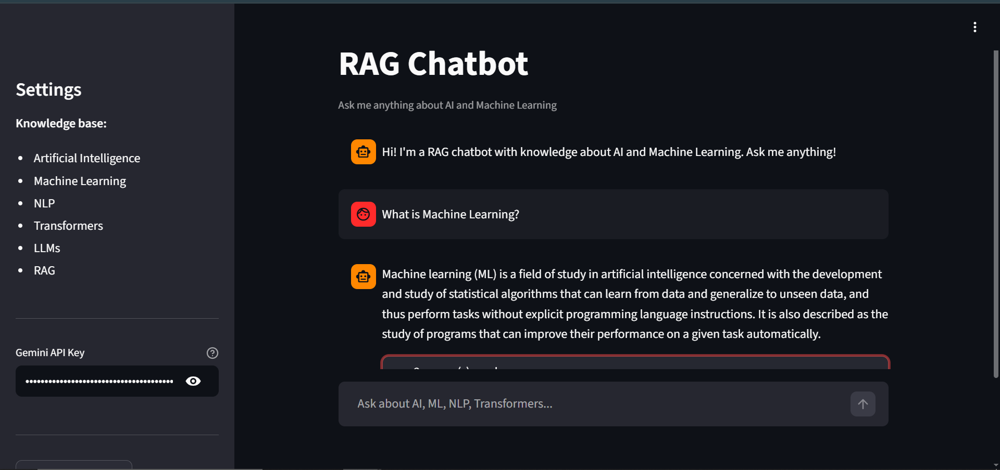
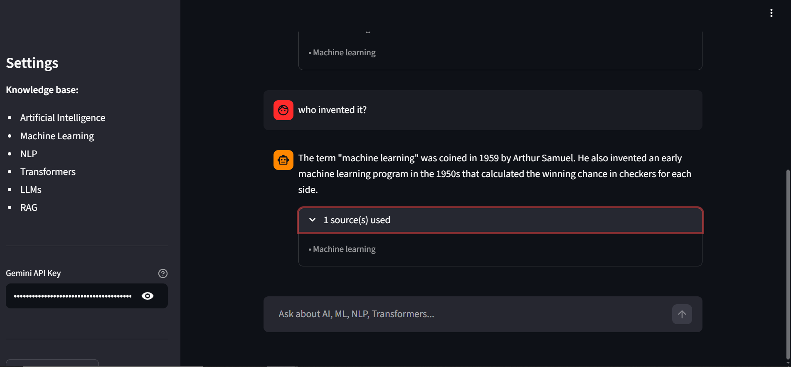
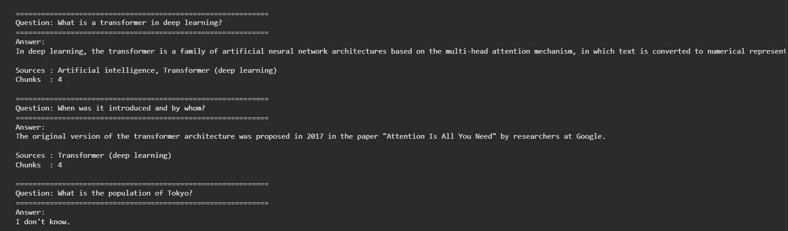

# DHC-Phase-2-ML-Task_4
A RAG Chatbot built with LangChain, FAISS, and Google Gemini 2.5 Flash. It answers questions based on Wikipedia articles about AI/ML, maintains conversation memory, and is deployed via Streamlit.
# RAG Chatbot — Context-Aware Conversational AI

> Built with **LangChain · FAISS · Google Gemini 2.5 Flash · Streamlit**

---

## Objective

Build a conversational chatbot that can **remember context across turns** and **retrieve accurate, grounded answers** from an external knowledge base — without hallucinating facts it doesn't know.

The chatbot combines Retrieval-Augmented Generation (RAG) with sliding-window conversation memory, giving it both factual grounding and multi-turn coherence.

---

## Project Structure

```
rag_chatbot/
├── RAG_Chatbot.ipynb        # Full pipeline: data loading → embedding → RAG chain → deployment
├── app.py                   # Streamlit UI (auto-generated by the notebook)
├── vectorstore/
│   └── faiss_index/
│       ├── index.faiss      # FAISS vector index
│       └── index.pkl        # Chunk metadata
├── results/
│   ├── Streamlit_UI_0.png   # Streamlit UI screenshot 1
│   ├── Streamlit_UI_1.png   # Streamlit UI screenshot 2
│   └── test.png             # Test run output screenshot
├── requirements.txt
├── .gitignore
└── README.md
```

---

## Methodology / Approach

### 1. Knowledge Base Construction
Six Wikipedia articles were fetched as the corpus:
- Artificial Intelligence · Machine Learning · Natural Language Processing
- Transformer (machine learning model) · Large Language Model · Retrieval-Augmented Generation

Combined, these articles total **~364,000 characters** across **6 documents**.

### 2. Chunking
Each article was split into overlapping chunks using `RecursiveCharacterTextSplitter`:
- **Chunk size:** 500 characters
- **Overlap:** 50 characters (preserves context at boundaries)
- **Result:** 1,153 chunks

### 3. Embedding & Vector Store
Each chunk was embedded into a **384-dimensional dense vector** using the local `sentence-transformers/all-MiniLM-L6-v2` model (no API key required). Vectors are stored in a **FAISS** index for fast similarity search and persisted to Google Drive to avoid rebuilding across sessions.

### 4. RAG Chain with Conversation Memory
The chain has four stages:

| Stage | Description |
|---|---|
| **History-aware retriever** | Rewrites follow-up questions into standalone queries using chat history (e.g. "Who invented it?" → "Who invented the Transformer architecture?") |
| **FAISS retrieval** | Fetches the top-4 most semantically relevant chunks for the rewritten query |
| **LLM (Gemini 2.5 Flash)** | Answers the question using *only* the retrieved context; refuses to speculate if the answer is absent |
| **Memory** | A sliding window of the last 5 conversation turns (10 messages) is maintained using LangChain `HumanMessage` / `AIMessage` objects |

### 5. Streamlit Deployment
The chatbot is deployed as a Streamlit web app. In Google Colab, a **pyngrok** tunnel exposes `localhost:8501` publicly. The app uses:
- `st.session_state` — persists chat history across Streamlit reruns
- `@st.cache_resource` — loads the embedding model and chain only once per session
- A sidebar for API key entry and conversation reset

### Tech Stack

| Component | Tool |
|---|---|
| LLM | Google Gemini 2.5 Flash |
| Embeddings | `sentence-transformers/all-MiniLM-L6-v2` (local) |
| Vector DB | FAISS (local, CPU) |
| Framework | LangChain + langchain-classic |
| UI | Streamlit |
| Tunnel | pyngrok (Colab deployment) |
| Storage | Google Drive (vector store persistence) |

---

## Key Results & Observations

### Test Results (Section 7 of notebook)

| Query | Expected Behaviour | Actual Result |
|---|---|---|
| *"What is a transformer in deep learning?"* | Direct factual answer | Answered correctly from context |
| *"When was it introduced and by whom?"* | Must use memory to resolve "it" | Correctly resolved to Transformer; cited 2017 + Google |
| *"What is the population of Tokyo?"* | Out-of-scope; should not hallucinate | Responded "I don't know" |

### Observations

- **Memory resolution works correctly** — pronouns and implicit references in follow-up questions are successfully rewritten into standalone queries before retrieval, preventing incorrect or irrelevant chunk lookups.
- **Hallucination is suppressed** — the system prompt instructs the LLM to answer only from retrieved context. Out-of-scope queries (e.g. Tokyo population) receive an honest "I don't know" instead of a fabricated answer.
- **Vector store persistence saves time** — saving the FAISS index to Google Drive means subsequent sessions skip the embedding step entirely (~80 MB model download + chunking).
- **Local embeddings reduce cost** — using `all-MiniLM-L6-v2` locally means no embedding API charges; only the Gemini inference calls are billed (free tier available).
- **Chunk size trade-off** — 500-character chunks with 50-character overlap balanced retrieval precision with context completeness. Larger chunks risk retrieving irrelevant content; smaller chunks risk cutting off mid-sentence context.

---

## Getting Started

### Prerequisites
- Python 3.10+
- A free [Google Gemini API key](https://aistudio.google.com/app/apikey)

### Installation

```bash
git clone https://github.com/your-username/rag_chatbot.git
cd rag_chatbot
pip install -r requirements.txt
```

### Running the Notebook
Open `RAG_Chatbot.ipynb` in Google Colab and run sections in order:
1. **Section 1** — Install libraries
2. **Section 2** — Mount Drive & set up paths
3. **Section 3** — Load & chunk Wikipedia documents *(skip if vector store exists)*
4. **Section 4** — Build & save FAISS index *(skip if vector store exists)*
5. **Section 5** — Enter your Gemini API key
6. **Section 6** — Build the RAG chain
7. **Section 7** — Run tests
8. **Section 8** — Launch Streamlit via ngrok

### Running Streamlit Locally
If running outside Colab, update the `FAISS_PATH` in `app.py` to your local path, then:

```bash
streamlit run app.py
```

---

## Results

| Streamlit UI | Streamlit UI | Test Output |
|:---:|:---:|:---:|
|  |  |  |

---

## Skills Demonstrated

- Conversational AI development with multi-turn memory
- Document embedding and vector similarity search
- Retrieval-Augmented Generation (RAG) pipeline design
- LLM integration (Google Gemini via LangChain)
- Streamlit app deployment with session state management

---

## License

This project is licensed under the [MIT License](LICENSE).
